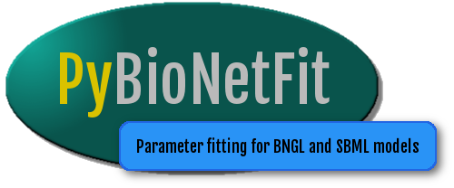

This application is for fitting BNGL and SBML models with metaheuristic methods. 

For documentation, refer to [Documentation.pdf](Documentation.pdf).

PyBioNetFit is released under the BSD-3 license. For more information, refer to the
[LICENSE](LICENSE). LANL code designation: C18062
