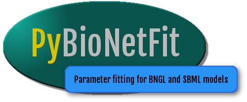

PyBioNetFit (PyBNF) is a general-purpose program for parameterizing biological models specified using the BioNetGen
rule-based modeling language (BNGL) or the Systems Biology Markup Language (SBML). PyBioNetFit offers a suite of
parallelized metaheuristic algorithms (differential evolution, particle swarm optimization, scatter search) for
parameter optimization. In addition to model parameterization, PyBNF supports uncertainty quantification by
bootstrapping or Bayesian approaches, and model checking. PyBNF includes an adaptive Markov chain Monte Carlo (MCMC) sampling algorithm, which supports Bayesian inference. PyBNF includes the Biological Property Specification Language
(BPSL) for defining qualitative data for use in parameterization or checking. It runs on most Linux and macOS
workstations as well on computing clusters.

For documentation, refer to [Documentation_PyBioNetFit.pdf](Documentation_PyBioNetFit.pdf) or the online documentation at <https://pybnf.readthedocs.io/en/latest/>.

## Installation

PyBNF requires Python 3.11 or higher.

```bash
python3 -m pip install pybnf
```

With `uv`, PyBNF can also be installed as a command-line tool:

```bash
uv tool install pybnf
```

PyBNF installs its Python dependencies, including BNGsim and libRoadRunner, through the package metadata. BNGL workflows can still require a BioNetGen installation for `BNG2.pl`; see the installation documentation for simulator setup details.

## Development

After cloning, run once:

```bash
make bootstrap
```

This installs the `pre-push` git hook (via `pre-commit`) so the bngsim test subset runs locally before any `git push`.

`pytest` runs the fast suite by default. Two opt-in tiers are deselected unless requested: `pytest -m slow` (statistical recovery against analytical targets) and `pytest -m recovery` (parameter recovery through the real bngsim backend; needs bngsim + BNG2.pl). Run `pytest --markers` for the full list, or see [tests/README_integration.md](tests/README_integration.md).

PyBioNetFit is released under the BSD-3 license. For more information, refer to the
[LICENSE](LICENSE). LANL code designation: C18062
