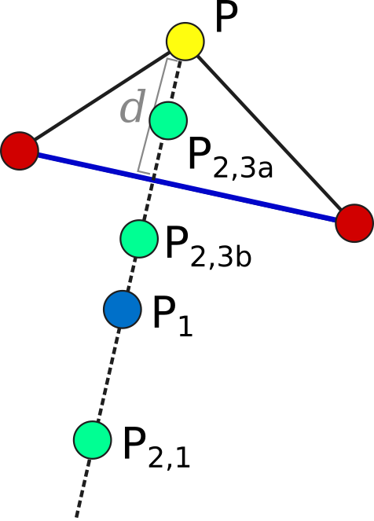

Fitting Algorithms
==================

Summary of Available Algorithms
-------------------------------

+-----------------------------+------------------+-----------------+---------------------------------------------------------------------------+
| Algorithm                   | Class            | Parallelization | Applications                                                              |
+=============================+==================+=================+===========================================================================+
| `Differential Evolution`_   | Population-based | Synchronous or  | General-purpose parameter fitting                                         |
|                             |                  | Asynchronous    |                                                                           |
+-----------------------------+------------------+-----------------+---------------------------------------------------------------------------+
| `Scatter Search`_           | Population-based | Synchronous     | Difficult problems with high dimensions or many local minima              |
+-----------------------------+------------------+-----------------+---------------------------------------------------------------------------+
| `Particle Swarm`_           | Population-based | Asynchronous    | Optimal use of a very large number of processors                          |
+-----------------------------+------------------+-----------------+---------------------------------------------------------------------------+
| `Markov Chain Monte Carlo`_ | Metropolis       | Independent     | Finding probability distributions of parameters                           |
|                             | sampling         | Markov Chains   |                                                                           |
+-----------------------------+------------------+-----------------+---------------------------------------------------------------------------+
| `Simulated Annealing`_      | Metropolis       | Independent     | Problem-specific applications                                             |
|                             | sampling         | Markov Chains   |                                                                           |
+-----------------------------+------------------+-----------------+---------------------------------------------------------------------------+
| `Parallel Tempering`_       | Metropolis       | Synchronized    | Finding probability distributions in challenging probablity landscapes    |
|                             | sampling         | Markov Chains   |                                                                           |
+-----------------------------+------------------+-----------------+---------------------------------------------------------------------------+
| `DREAM`_                    | Hybrid           | Synchronous     | \?\?\?\?                                                                  |
|                             | Population /     |                 |                                                                           |
|                             | Metropolis       |                 |                                                                           |
+-----------------------------+------------------+-----------------+---------------------------------------------------------------------------+
| `Simplex`_                  | Local search     | Synchronous     | Local optimization, or refinement of a result from another algorithm.     |
+-----------------------------+------------------+-----------------+---------------------------------------------------------------------------+

General implementation features for all algorithms
--------------------------------------------------

All algorithms in PyBNF keep track of a list of parameter sets (a "population"), and over the course of the simulation, submit new parameter sets to run on the simulator. Algorithms periodically output the file ``sorted_params.txt`` containing the best parameter sets found so far, and the corresponding objective function values. 

Initialization
^^^^^^^^^^^^^^

The initial population of parameter sets is generated based on the keys specified for each free parameter: ``uniform_var``, ``loguniform_var``, ``normal_var`` or ``lognormal_var``. The value of the parameter in each new random parameter set is drawn from the specified probability distribution. 

The ``latin_hypercube`` option for initialization is enabled by default. This option only affects initialization of ``uniform_var``\ s and ``loguniform_var``\ s. When enabled, instead of drawing an independent random value for each starting parameter set, the starting parameter sets are generated with Latin hypercube sampling, which ensures a roughly even distribution of the parameter sets throughout the search space. 

.. _objective:

Objective functions
^^^^^^^^^^^^^^^^^^^

All algorithms use an objective function to evaluate the quality of fit for each parameter set. The objective function is set with the ``objfunc`` key. The following options are available. Note that :math:`y_i` are the experimental data points and :math:`a_i` are the simulated data points. The summation is over all experimental data points.
    * Chi squared (``obj_func = chi_sq``): :math:`f(y, a) =  \sum_i \frac{(y_i - a_i)^2}{\sigma_i^2}` . :math:`\sigma_i` is the standard deviation of point :math:`y_i`, and must be specified in the :ref:`exp file <exp-file>`.
    * Sum of squares (``obj_func = sos``): :math:`f(y, a) =  \sum_i (y_i - a_i)^2`
    * Normalized sum of squares (``obj_func = norm_sos``): :math:`f(y, a) =  \sum_i \frac{(y_i - a_i)^2}{y_i}`
    * Average-normalized sum of squares (``obj_func = ave_norm_sos``): :math:`f(y, a) =  \sum_i \frac{(y_i - a_i)^2}{\bar{y}}`, where :math:`\bar{y}` is the average of the entire data column :math:`y`.
    
If you include any :ref:`constraints <con-file>` in your fit, the constraints add extra terms to the objective function. 

Changing parameter values
^^^^^^^^^^^^^^^^^^^^^^^^^

All algorithms perform changes to parameter values as the fitting proceeds. The way these changes are calculated also depends on the type of parameter. 

``loguniform_var``\ s and ``lognormal_var``\ s are moved in logarithmic space throughout the entire fitting run. 

``uniform_var``\ s and ``loguniform_var``\ s avoid moving outside the defined initialization range. If a move is attempted that would take the parameter outside the bounds, the parameter value is reflected over the boundary, back within bounds. This feature can be disabled by appending ``U`` to the end of the variable definition (e.g. ``uniform_var = x__FREE__ 10 30 U``)

.. _alg-de:

Differential Evolution
----------------------

Algorithm
^^^^^^^^^
A population of individuals (points in parameter space) are iteratively evaluated with an objective function.  Parent individuals from the current iteration are selected to form new individuals in the next iteration.  The new individual's parameters are derived by combining parameters from the parents. New individuals are accepted into the population if they have an objective value lower than that of a member of the current population 

Parallelization
^^^^^^^^^^^^^^^
PyBNF offers parallel, synchronous differential evolution. In each iteration, n simulations are run in parallel, but all must complete before moving on to the next iteration. 

It also offers parallel, asynchronous differential evolution, in which the current population consists of m islands. Each island is able to move on to the next iteration even if other islands are still in progress. If m is set to the number of available processors, then processors will never sit idle. Note however that this might still underperform compared to the synchronous algorithm run on the same number of processors. 

Implementation details
^^^^^^^^^^^^^^^^^^^^^^
PyBNF uses the implementation of asynchronous differential evolution described in [Penas2015]_. The synchronous algorithm is a special case in which there is only one island and no migration step. 

We maintain a list of ``population_size`` current parameter sets, and in each iteration, ``population_size`` new parameter sets are proposed. The method to propose a new parameter set is specified by the config key ``de_strategy``. The default setting ``rand1`` works best for most problems, and runs as follows: We choose 3 random parameter sets p1, p2, and p3 in the current population. For each free parameter P, the new parameter set is assigned the value p1[P] + ``mutation_factor`` * (p2[P]-p3[P]) with probability ``mutation_rate``, or p1[P] with probability 1 - ``mutation_rate``. The new parameter set replaces the parameter set with the same index in the current population if it has a lower objective value. 

With ``de_strategy`` of ``best1`` or ``best2``, we force the above p1 to be the parameter set with the lowest objective value. With ``de_strategy`` of ``all1`` or ``all2``, we force p1 to be the parameter set at the same index we are proposing to replace. The ``best`` strategy results in fast convergence to what is likely only a local optimum. The ``all`` strategy converges more slowly, and prevents the entire population from converging to the same value. However, there is still a risk of each member of the population becoming stuck in its own local minimum. For the ``de_strategy``s ending in ``2``, we instead choose a total of 5 parameter sets, p1 through p5, and set the new parameter value as p1[P] + ``mutation_factor`` * (p2[P]-p3[P] + p4[P]-p5[P])

.. _alg-island:

In the asynchronous version of the algorithm, the population is divided into ``num_islands`` islands, which each follow the above update procedure independently. Every ``migrate_every`` iterations, a migration step occurs in which ``num_to_migrate`` individuals from each island are transferred randomly to others (according to a random permutation of the islands, keeping the number of individuals on each island constant). The migration step does not require synchronization of the islands; it is performed when the last island reaches the appropriate iteration number, regardless of whether other islands are already further along. 

Applications
^^^^^^^^^^^^
In our experience, differential evolution tends to be the best general-purpose algorithm, and we suggest it as a starting point for a new fitting problem if you are unsure which algorithm to choose. 

.. _alg-ss:

Scatter Search
--------------

Algorithm
^^^^^^^^^
Scatter Search [Glover2000]_ functions similarly to differential evolution, but maintains a smaller current population than the number of available processors. In each iteration, every possible pair of individuals are combined to propose a new individual.

Parallelization
^^^^^^^^^^^^^^^
In a scatter search run of population size n, each iteration requires n\*(n-1) independent simulations that can all be run in parallel. Scatter search requires synchronization at the end of each iteration, waiting for all simulations to complete before moving to the next iteration. 

Implementation details
^^^^^^^^^^^^^^^^^^^^^^
The PyBNF implementation follows the outline presented in the introduction of [Penas2017]_ and uses the recombination method described in [Egea2009]_.

We maintain a reference set of ``population_size`` individuals, recommended to be a small number (~ 12-18). Each newly proposed parameter set is based on a "parent" parameter set and a "helper" parameter set, both from the current reference set. In each iteration, we consider all possible parent-helper combinations, for a total of n\*(n-1) parameter sets. The new parameter set depends on the rank of the parent and helper (call them pi and hi) when the reference set is sorted from best to worst. 

Then we apply a series of formulas to choose the next parameter value.

Let :math:`\alpha` = -1 if hi>pi or 1 if pi<hi, let :math:`\beta = (|hi-pi|-1) / (n-2)`, let :math:`d = \textrm{helper}[P] - \textrm{parent}[P]` for some parameter P. 

Then the in the new parameter set, :math:`P = \textrm{parent}[P] + \textrm{rand\_uniform}(-d * (1 + \alpha * \beta), d * (1 - \alpha * \beta))`

Intuitively what we do here is perturb P on the order of d (which acts as a measure of the variability of P in the population). If the parent is better than the helper, we keep P closer to the parent, and if the helper is better, we shift it closer to the helper. 

The proposed new parameter set is accepted if it achieves a lower objective value than its parent.

If a parent goes ``local_min_limit`` iterations without being replaced by a new parameter set, it is assumed to be stuck in a local minimum, and is replaced with a new random parameter set. The random parameter set is drawn from a "reserve queue", which is initialized at the start of the fitting run to contain ``reserve_size`` Latin hypercube distributed samples. The reserve queue ensures that each time we take a new random parameter set, we are sampling a part of parameter space that we have not sampled previously. 

Applications
^^^^^^^^^^^^
We find scatter search is also a good general-purpose fitting algorithm. It performs especially well on fitting problems that are difficult due to a search space that is high dimensional or contains many local minima. 

.. _alg-pso: 

Particle Swarm
--------------

Algorithm
^^^^^^^^^
In particle swarm optimization, each parameter set is represented by a particle moving through parameter space at some velocity. The acceleration of each particle is set in a way that moves it toward more favorable areas of parameter space: the acceleration has contributions pointing toward both the best parameter set seen so far by the individual particle, and the global best parameter set seen by any particle in the population. 

Parallelization
^^^^^^^^^^^^^^^
Particle swarm optimization in PyBNF is an asynchronous, parallel algorithm. As soon as one simulation completes, that particle can calculate its next parameter set and begin a new simulation. Processors will never remain idle, and adding an arbitrarily large number of processors will continue to improve the performance of the algorithm [citation needed].

Implementation details
^^^^^^^^^^^^^^^^^^^^^^
The PyBNF implementation is based on the description in [Moraes2015]_. Each particle keeps track of its current position, velocity, and the best parameter set it has seen during the run. 

After each simulation completes, the velocity of the particle is updated according to the formula v[i+1] = w\*v[i] + c1\*u1*(xi-x_min) + c2\*u2\*(xi-x_globalmin). The constants in the above formula may be set with config keys: w is ``particle_weight``, c1 is ``cognitive``, and c2 is ``social``. xi is the current particle position, v[i] is the current velocity, v[i+1] is the updated velocity, x_min is the best parameter set this particle has seen, and x_globalmin is the best parameter set any particle has seen. u1 and u2 are uniform random numbers in the range [0,1]. Following the velocity update, the position of the particle is updated by adding its current velocity. 

We apply a special treatment if a ``uniform_var`` or ``loguniform_var`` moves outside of the specified box constraints. As with other algorithms, the particle position is reflected back inside the boundaries. In addition, the component of the velocity corresponding to the parameter that moved out of bounds is set to zero, to prevent the particle from immediately crossing the same boundary again. 

.. _pso-adaptive:

An optional feature (discussed in [Moraes2015]_) allows the particle weight w to vary over the course of the simulation. In the original algorithm descirption, w was called "inertia weight", but when w takes a value less than 1, it can be thought of as friction - a force that decelerates particles regardless of the objective function evaluations. The idea is to reduce w (increase friction) over the course of the fitting run, to make the particles come to a stop at a good objective value by the end of the run. 

When using the adaptive friction feature, w starts at ``particle_weight``, and approaches ``particle_weight_final`` by the end of the simulation. The value of w changes based on how many iterations we deem "unproductive" according to the following criterion: An iteration is unproductive if the global best objective function obj_min changes by less than ``adaptive_abs_tol`` + ``adaptive_rel_tol`` \* obj_min, where ``adaptive_abs_tol`` and ``adaptive_rel_tol`` can be set in the config. Then, we keep track of N, the total number of unproductive iterations so far. At each iteration we set w = ``particle_weight`` + (``particle_weight_final`` - ``particle_weight``) \* N / (N + ``adaptive_n_max``). As can be seen in the above formula, the config key ``adaptive_n_max`` sets the number of unproductive iterations it takes to reach halfway between ``particle_weight`` and ``particle_weight_final``.

Applications
^^^^^^^^^^^^
Particle swarm optimization becomes advantageous over the other available algorithms when many processors are available (>100), and when the runtime per simulation can vary greatly depending on the parameter set (such as in some SSA and NFSim runs). In these cases, the asynchronicity of the particle swarm allows you to take full advantage of all available processors at all times. 

.. _alg-mcmc:

Markov Chain Monte Carlo
------------------------

Algorithm
^^^^^^^^^
Markov chain Monte Carlo is a Bayesian method in which points in parameter space are sampled with a frequency
proportional to the probability that the parameter set is correct given the data. The result is a probability
distribution over parameter space that expresses the likelihood of each possible parameter set. With this algorithm, we
obtain not just a point estimate of the best fit, but a means to quantify the uncertainty in each parameter value.

When running Markov chain Monte Carlo, PyBNF outputs additional files containing this probability distribution information. The files in ``Results/Histograms/`` give histograms of the marginal probability distributions for each free parameter. The files ``credible##.txt`` (e.g., ``credible95.txt``) use the marginal histogram for each parameter to calculate a *credible interval* - an interval in which the parameter value is expected to fall with the specified probability (e.g. 95%).  Finally, ``samples.txt`` contains all parameter sets sampled over the course of the fitting run, allowing the user to perform further custom analysis on the sampled probability distribution. 

Parallelization
^^^^^^^^^^^^^^^
Markov chain Monte Carlo is not an inherently parallel algorithm. In the Markov chain, we need to know the current state before proposing the next one. However, PyBNF supports running several independent Markov chains by specifying the number of chains with the ``population_size`` key. All samples from all parallel chains are pooled to obtain a better estimate of the final posterior probability distribution. 

Note that each chain must independently go through the burn-in period, but after the burn-in time, your rate of sampling will be improved proportional to the number of parallel chains in your run. 

Implementation details
^^^^^^^^^^^^^^^^^^^^^^
Our implementation is described in [Kozer2013]_. We start at a random point in parameter space, and make a step of size ``step_size`` to move to a new location in parameter space. We take the value of the objective function to be the probability of the data given the parameter set (the *likelihood* in Bayesian statistics).  We assume a prior distribution based on the parameter definitions in the config file -- a uniform, loguniform, normal, or lognormal distribution, depending on the config key used. Note: If a uniform or loguniform prior is used, the prior does not affect the result other than to confine the distribution within the specified range. If a normal or lognormal prior is used, the prior does affect the probability of accepting each proposed move, and therefore the choice of prior affects the final sampled probability distribution. 

The Bayesian *posterior* distribution -- the probability of the parameters given the data -- is given by the product of the above likelihood and prior. We use the value of the posterior to determine whether to accept the proposed move. 

Moves are accepted according to the Metropolis criterion. If a move increases the value of the posterior, it is always accepted. If it decreases the value of the posterior, it is accepted with probability :math:`e^{- \beta \Delta F}`, where :math:`\Delta F` is the change in the posterior, and :math:`\beta` (an analog for 1/Temperature) is taken to be 1 in this simple implementation.

Applications
^^^^^^^^^^^^
Markov chain Monte Carlo is the simplest method available in PyBNF to generate a probability distribution in parameter space. 

.. _alg-sa:

Simulated Annealing
-------------------

Algorithm
^^^^^^^^^
Simulated annealing is another Markov chain-based algorithm, but our goal is not to find a full probability distribution, just find the optimal parameter set. To do so, we start the Markov chain at a high temperature, where unfavorable moves are accepted frequently, and gradually reduce the temperature over the course of the simulation. The idea is that we will explore parameter space broadly at the start of the fitting run, and become more confined to the optimal region of parameter space as the run proceeds. 

Parallelization
^^^^^^^^^^^^^^^
Simulated annealing is not an inherently parallel algorithm. The trajectory is a Markov chain in which we need to know the current state before proposing the next one. However, PyBNF supports running several independent simulated annealing chains in parallel. By running many chains simulatenously, we have a better chance that one of the chains achieves a good final fit. 

Implementation details
^^^^^^^^^^^^^^^^^^^^^^
The Markov chain is implemented in the same way as described above for the Markov chain Monte Carlo algorithm, incorporating both the objective function value and the prior distribution to calculate the posterior probability density. 

The difference is in the Metropolis criterion for acceptance of a proposed move. Here, a move that decreases the value of the posterior is accepted with probability :math:`e^{- \beta \Delta F}`, where :math:`\beta` decreases over the course of the fitting run. 

Applications
^^^^^^^^^^^^
We have not found any problems for which simulated annealing is better than the other available algorithms, but provide the functionality with the hope that it proves useful for some specific problems. 

.. _alg-pt:

Parallel Tempering
------------------

Algorithm
^^^^^^^^^
Parallel tempering is a more sophisticated version of Markov chain Monte Carlo. We run several Markov chains in parallel at different temperatures. At specified iterations during the run, there is an opportunity to exchange replicates between the different temperatures. Only the samples recorded at the lowest temperature count towards our final probability distribution, but the presence of the higher temperature replicates makes it easier to escape local minima and explore the full parameter space. 

When running parallel tempering, PyBNF outputs files containing probability distribution information, the same as with Markov chain Monte Carlo.

Parallelization
^^^^^^^^^^^^^^^
The replicates are run in parallel. Synchronization is required at every iteration in which we attempt replica exchange. 

Implementation details
^^^^^^^^^^^^^^^^^^^^^^
The PyBNF implementation is based on the description in [Gupta2018]_. Markov chains are run by the same method as in Markov chain Monte Carlo, except that the value of :math:`\beta` in the acceptance probability :math:`e^{- \beta \Delta F}` varies between replicas. 

Every ``exchange_every`` iterations, we attempt replica exchange. We propose moves that consist of swapping two replicas between adjacent temperatures. Moves are accepted with probability :math:`\min (1, e^{\Delta \beta \Delta F})` where :math:`\Delta \beta` is the change in :math:`\beta` = 1/Temperature, and :math:`\Delta F` is the difference in the objective values of the replicas. In other words, moves that transfer a lower-objective replica to a lower temperature (higher :math:`\beta`) are always accepted, and those that transfer a higher-objective replica to a lower temperature are accepted with a Metropolis-like probability based on the extent of objective difference. 

The list of :math:`\beta`s used is customizable with the ``beta`` or ``beta_range`` key. The number of replicas per temperature is also customizable. To maintain detailed balance, it is required that each temperature contains the same number of replicas. 

Applications
^^^^^^^^^^^^
Like ordinary Markov chain Monte Carlo, the goal of parallel tempering is to provide a distribution of possible parameter values rather than a single point estimate. 

Compared to ordinary Markov chain Monte Carlo, parallel tempering offers a trade-off: Parallel tempering generates fewer samples per unit CPU time (because most of the processors run higher temperature simulations that don't sample the distribution of interest), but traverses parameter space more efficiently, making each sample more valuable. The decision between parallel tempering and Markov chain Monte Carlo therefore depends on the nature of your parameter space: parallel tempering is expected to perform better when the space is complex, with many local minima that make it challenging to explore. 

.. _alg-dream:

DREAM
-----

Algorithm
^^^^^^^^^
**D**\ iffe\ **R**\ ential **E**\ volution **A**\ daptive **M**\ etropolis (DREAM), described in [Vrugt2016]_, is an
MCMC approach for estimating the joint probability distribution of a model's free parameters.  DREAM combines features
from traditional Bayesian MCMC (e.g. the Metropolis-Hastings acceptance criterion) and differential evolution (parameter
recombination).  DREAM is purported to accelerate convergence of the MCMC as well as facilitate sampling of multimodal
distributions.

Parallelization
^^^^^^^^^^^^^^^
DREAM uses parallel MCMC chains whose current state behaves as an individual in a differential evolution fitting run.
Upon evaluation of each individual (by applying the Metropolis-Hastings criterion), a proposal individual is created
according to the differential evolution update strategy ``all1``.  Thus the algorithm is synchronized based on the
evaluation of the current "generation"

Implementation details
^^^^^^^^^^^^^^^^^^^^^^
Many details here are similar to those in the traditional MCMC algorithm, including the requirement for prior
distributions for the parameters, and the use of the Metropolis-Hastings criterion for acceptance.  However, the use
of differential evolution features introduces a number of distinctions.  To maintain the required detailed balance
necessary for MCMC proposal distributions, random perturbations must be introduced to reach all of parameter space.
Thus a simple proposal for some chain :math:`X` on iteration :math:`i` is :math:`X_{i+1} = X_i + \gamma\left(X_a - X_b\right) + \zeta`
where :math:`\zeta` is drawn from a standard normal distribution with small standard deviation and :math:`\gamma` is the
``step_size`` configuration parameter.

DREAM also incorporates subspace sampling in parameter space, meaning that only a subset of the parameters may be
modified by the differential evolution update.  A "crossover" number can be set in the configuration file that
defines a multinomial probability distribution that governs whether a particular parameter will be updated
(the ``crossover_number`` key).  For each parameter to be updated, we perform the traditional differential evolution
update (calculating the difference between two other chains for the parameter and scaling by :math:`\gamma`) and then
introduce another random perturbation that is uniformly distributed between :math:`-\lambda` and :math:`\lambda` as
defined in the configuration file with key ``lambda``.

Finally, DREAM enables jumping (approximately) between modes in the posterior distribution.  The user may specify the
frequency of this jump (which effectively sets :math:`\gamma = 1`) by setting the key ``gamma_prob`` to value between 0
and 1 in the configuration file.

The algorithm described here is similar to Algorithm 5 in [Vrugt2016]_, but with a few omissions.  The algorithm does
not implement a convergence check (such as the Gelman-Rubin diagnostic), and we do not automatically prune outlier
chains.

.. _alg-sim:

Simplex
-------

Algorithm
^^^^^^^^^
Simplex is a local search algorithm that operates solely on objective evaluations at single points (i.e. it does not require calculation of gradients). The algorithm maintains a set on N+1 points in N-dimensional parameter space, which are thought of as defining an N-dimensional solid called a *simplex*. Individual points may be reflected through the lower-dimensional solid defined by the other N points, to obtain a local improvement in objective function value. The simplex algorithm has been nicknamed the "amoeba" algorithm because the simplex crawls through parameter space similar to an amoeba, extending protrusions in favorable directions.

Parallelization
^^^^^^^^^^^^^^^
The PyBNF Simplex implementation is parallel and synchronous. Synchronization is required at the end of every iteration. Parallelization is achieved by simultaneously evaluating a subset of the N+1 points in the simplex. Therefore, this parallelization can take advantage of at most N+1 processors, where N is the number of free parameters. 

Implementation details
^^^^^^^^^^^^^^^^^^^^^^
PyBNF implements the parallelized Simplex algorithm described in [Lee2007]_. 

The initial simplex consists of N+1 points chosen deterministically based on the specified step size (set with the ``simplex_step`` and ``simplex_log_step`` keys, or for individual parameters with the ``var`` and ``log_var`` keys). One point of the simplex is the specified starting point for the search. The other N points are obtained by adding the step size to one parameter, and leaving the other N-1 parameters at the starting values.

   Illustration of the simplex algorithm, modifying point P on a 3-point simplex in 2 dimensions

Each iteration, we operate on the k worst points in the simplex, where k is the number of available processors (``parallel_count``). For each point P, we  consider the hyperplane defined by the other N points in the simplex (blue line). Let d be the distance from P to the hyperplane. We evaluate point P\ :sub:`1` obtained by reflecting P through the hyperplane, to a distance of d \* ``simplex_reflect`` on the other side. Depending on the resulting objective value, we try another point in the second phase of the iteration. Three cases are possible.

1) The new point is better than the current global minimum: We try a second point continuing in the same direction for a distance of d \* ``simplex_expansion`` away from the hyperplane (P\ :sub:`2,1`).
2) The new point is worse than the global minimum, but better than the next worst point in the simplex: We don't try a second point.
3) The new point is worse than the next worst point in the simplex: We try a second point moving closer to the hyperplane. If P was better than P\ :sub:`1`, we try a point a distance of d \* ``simplex_contraction`` from the hyperplane in the direction of P (P\ :sub:`2,3a`). If P\ :sub:`1` was better than P, we instead try the same distance from the hyperplane in the direction of P\ :sub:`1` (P\ :sub:`2,3b`).

In all cases, P in the simplex is set to the best choice among P, P\ :sub:`1`, or whichever second point we tried.

    If in a given iteration, all k points resulted in Case 3 and did not update to P\ :sub:`2,3a` or P\ :sub:`2,3b`, the iteration did not effectively change the state of the simplex. Then, we contract the simplex towards the best point: We set each point P to ``simplex_contract`` \* P0 + (1 - ``simplex_contract``) \* P, where P0 is the best point in the simplex.

Applications
^^^^^^^^^^^^
Local optimization with the simplex algorithm is useful for improving on an already known good solution. In PyBNF, the most common application is to apply the simplex algorithm to the best-fit result obtained from one of the other algorithms. You can automatically refine your final result with the simplex algorithm by setting the ``refine`` key to 1, and setting simplex config keys in addition to the config for your main algorithm. 

It is also possible to run the Simplex algorithm on its own, using a custom starting point. In this case, you should use the ``var`` and ``log_var`` keys to specify your known starting point. 

.. [Egea2009] Egea, J. A.; Balsa-Canto, E.; García, M.-S. G.; Banga, J. R. Dynamic Optimization of Nonlinear Processes with an Enhanced Scatter Search Method. Ind. Eng. Chem. Res. 2009, 48 (9), 4388–4401.
.. [Glover2000] Glover, F.; Laguna, M.; Martí, R. Fundamentals of Scatter Search and Path Relinking. Control Cybern. 2000, 29 (3), 652–684.
.. [Gupta2018] Gupta, S.; Hogg, J. S.; Lee, R. E. C.; Faeder, J. R. Evaluation of Parallel Tempering to Accelerate Markov Chain Monte Carlo Methods for Parameter Estimation in Systems Biology. arXiv 2018, 1801.09831.
.. [Kozer2013] Kozer, N.; Barua, D.; Orchard, S.; Nice, E. C.; Burgess, A. W.; Hlavacek, W. S.; Clayton, A. H. A. Exploring Higher-Order EGFR Oligomerisation and Phosphorylation—a Combined Experimental and Theoretical Approach. Mol. BioSyst. Mol. BioSyst 2013, 9 (9), 1849–1863.
.. [Lee2007] Lee, D.; Wiswall, M. A Parallel Implementation of the Simplex Function Minimization Routine. Comput. Econ. 2007, 30 (2), 171–187.
.. [Moraes2015] Moraes, A. O. S.; Mitre, J. F.; Lage, P. L. C.; Secchi, A. R. A Robust Parallel Algorithm of the Particle Swarm Optimization Method for Large Dimensional Engineering Problems. Appl. Math. Model. 2015, 39 (14), 4223–4241.
.. [Penas2015] Penas, D. R.; González, P.; Egea, J. A.; Banga, J. R.; Doallo, R. Parallel Metaheuristics in Computational Biology: An Asynchronous Cooperative Enhanced Scatter Search Method. Procedia Comput. Sci. 2015, 51 (1), 630–639.
.. [Penas2017] Penas, D. R.; González, P.; Egea, J. A.; Doallo, R.; Banga, J. R. Parameter Estimation in Large-Scale Systems Biology Models: A Parallel and Self-Adaptive Cooperative Strategy. BMC Bioinformatics 2017, 18 (1), 52.
.. [Vrugt2016] Vrugt, J. Markov chain Monte Carlo simulation using the DREAM software package: Theory, concepts, and MATLAB implementation. Environmental Modelling and Software 2016, 75, 273-316.
